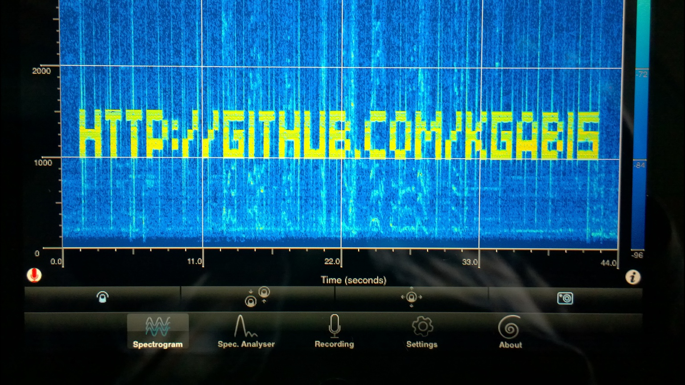

##About
SpectrumPrinter prints messages which can be read using spectrograms (for instance using [SpectrumView](https://itunes.apple.com/us/app/spectrumview/id472662922?mt=8)).

##Usage:
Compile using make and run:
```./spectrum-printer "message"```

##Dependencies
[PortAudio](http://www.portaudio.com/)

##Screens


##License
[The MIT License (MIT)](http://opensource.org/licenses/mit-license.php)