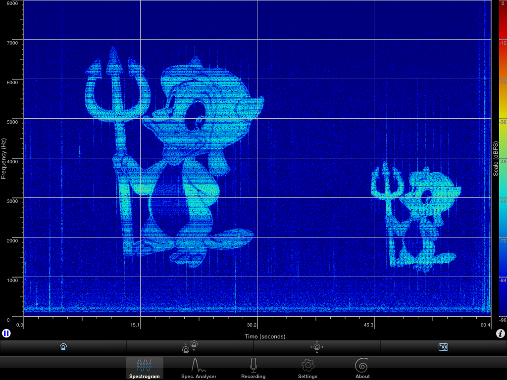

##About
SpectrumPrinter converts images or messages to audio signals, which can be viewed using spectrograms (with [Audacity](http://audacity.sourceforge.net/) or [SpectrumView](https://itunes.apple.com/us/app/spectrumview/id472662922?mt=8)).

##Usage:
Compile using make (```make```) and run:

```./spectrum-printer "message"```

Some additional options can be used, for instance:

```./spectrum-printer "message" lines=40 min=1000 max=2000 time=400```

Prints "message" using 40 lines (frequencies) ranging from 1000 to 2000 Hz, where each column takes 400ms.

You can also print images. To prepare image use ```./prepare_image.sh input_file output_file height``` and use image=true option.
Example:

```./spectrum-printer cameraman.pgm image=true min=1000 max=6000 time=100```

When printing images lines option is ignored.

##Dependencies
[PortAudio V19](http://www.portaudio.com/)

##Screens



##License
[The MIT License (MIT)](http://opensource.org/licenses/mit-license.php)